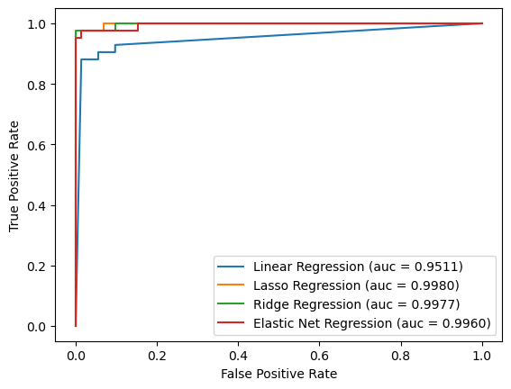
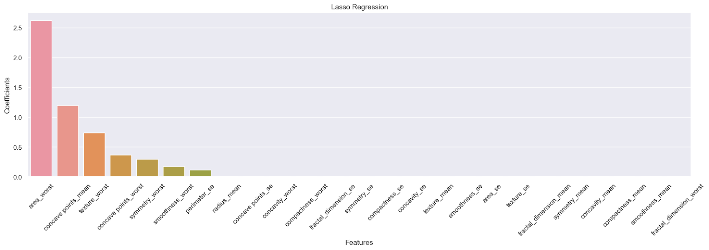
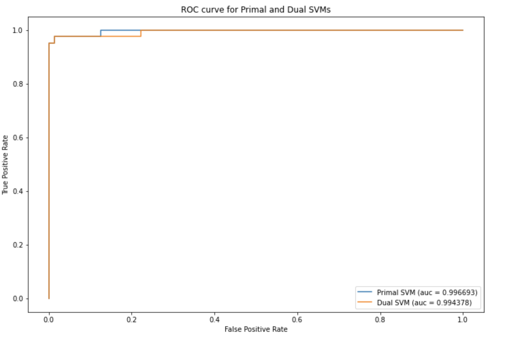
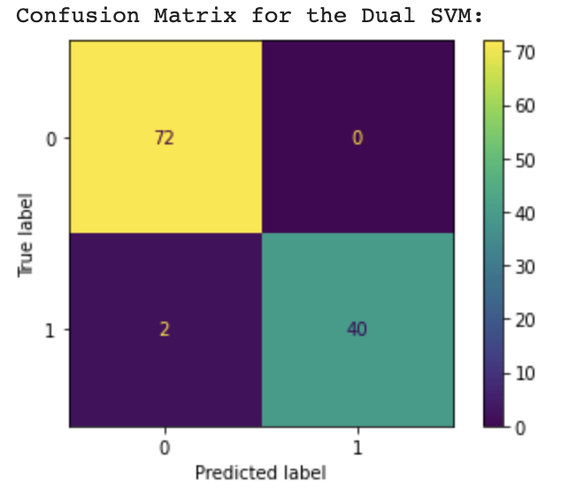
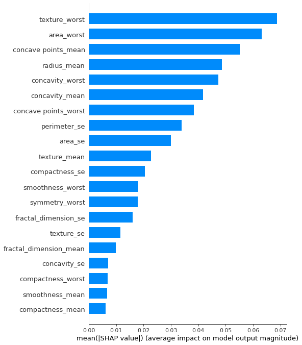
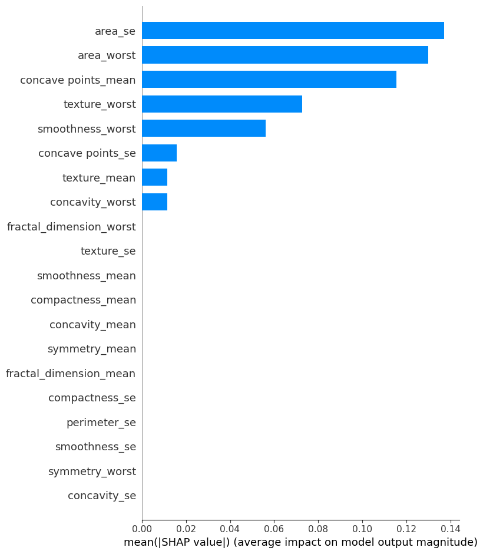
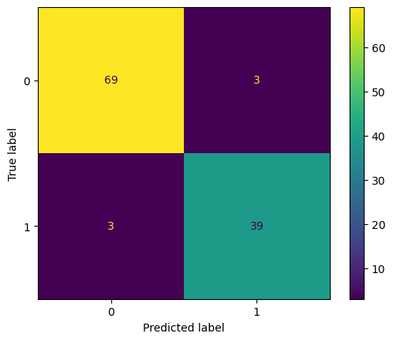
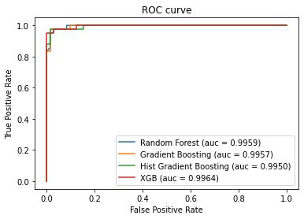
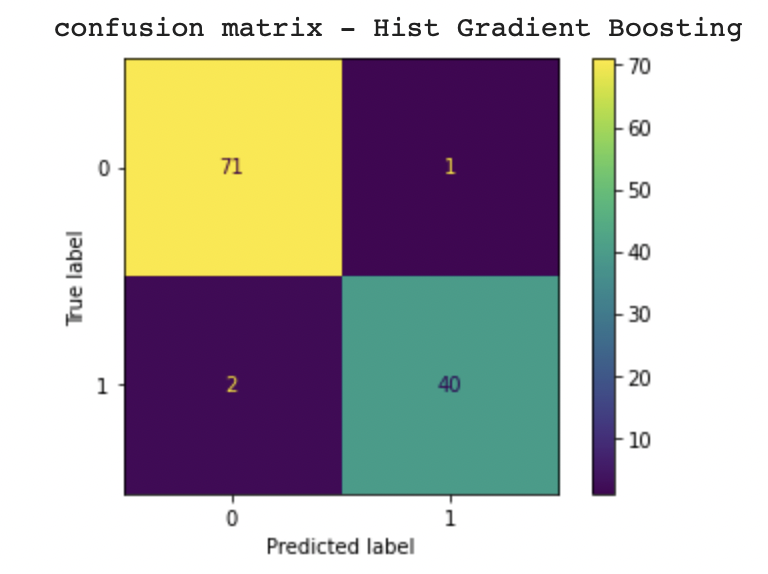
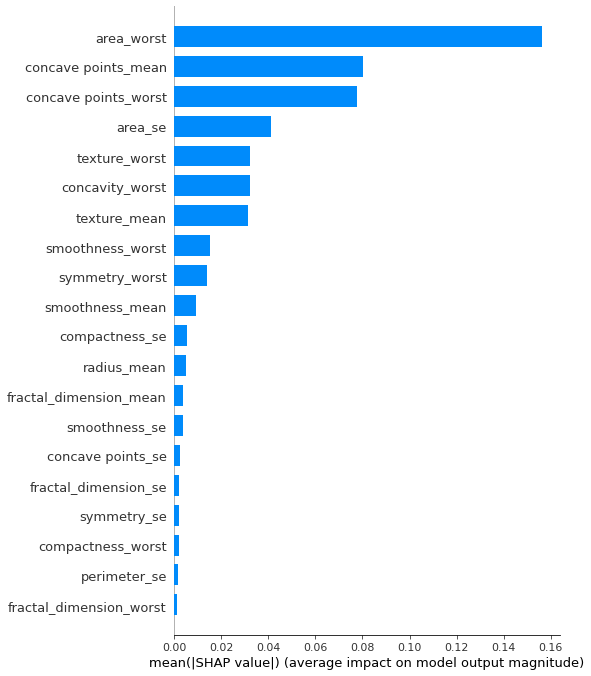

<h1>
  AML Final Project Report
</h1>

# Introduction

Breast cancer is the most common cancer among women in the world. It accounts for 25% of all cancer cases and affected over 2.1 Million people in 2015 alone. These cells usually form tumors that can be seen via X-ray or felt as lumps in the breast area.

In this project, we will apply machine learning models to help classify benign or malicious tumors through the dataset from Breast Cancer Wisconsin (Diagnostic)[^f1]. We will use logistic regression, support vector machine, decision tree, and boosting techniques to approach the classification problem.

[^f1]:  https://www.kaggle.com/datasets/yasserh/breast-cancer-dataset 

# Data Preprocessing

The data set contains 30 features after dropping meaningless features such as the patient's ID in the data exploration process. To eliminate the multicollinearity of the features, we computed the correlation matrix and removed the features that caused more than 0.95 correlations. During data exploration, we also noticed that the data set was imbalanced. There are 62.7% benign samples and 37.3% malicious samples. We will apply to stratify technique during the train test split process and adopt the f-1 score as the key metric. We also employed sampling methods such as oversampling or SMOTE to increase the number of samples.

# Machine Learning Models

## Logistic Regression

After dropping the highly correlated features, logistic regression is a desirable and simple machine learning model to apply to predict categorical targets, which are benign and malicious tumors. In this section, we design and implement simple logistic regression and logistic regression with regularization, such as L1, L2, and both. We applied a grid search with cross-validation to discover the best hyperparameter for each model. Because the dataset is imbalanced, the f1 score is a good metric for cross-validation. The performance of each model on test data is below:

|             | Accuracy | Precision | Recall | F1 Score | AUC    |
| :---------- | -------- | --------- | ------ | -------- | ------ |
| Simple      | 0.947    | 0.974     | 0.881  | 0.925    | 0.9511 |
| Lasso       | 0.982    | 1         | 0.952  | 0.976    | 0.9980 |
| Ridge       | 0.982    | 1         | 0.952  | 0.976    | 0.9977 |
| Elastic Net | 0.982    | 1         | 0.952  | 0.976    | 0.9960 |

From the table above, confusion matrix and ROC plot, regularization helps improve the model from all metrics. Compared with the model with regularization, Lasso regression has a higher AUC score. The top 5 weighted features in the lasso regression model are area_worst, concave points_mean, texture_worst, concave points_worst, and symmetry_worst.

## Support Vector Machine (SVM)

For support vector machines, we explored primal and dual SVMs to understand which model would perform better on our dataset. The accuracy of baseline Primal SVM and Dual SVM is 0.964 and 0.984. Both models perform well, and Dual SVM has a greater f1 score. And after hyperparameter tuning through grid search, the accuracy of the Dual SVM model changed to 0.974. Considering the accuracy of the test dataset was quite high, it seems that choosing to use SVMs has also helped the model with overfitting. 

For both models, texture_worst was the most important feature by SHAP value, with the primal SVM having “conacve_points_mean” and “concavity_worst” as the second and third, respectively, while the dual SVM had “concavity_mean” and “concave_points_mean” as its second and third by SHAP value. 

## Decision Trees

Our investigation of tree-based models started with decision trees and expanded to balanced decision trees. Since the dataset was slightly skewed in the number of classes represented, we applied random oversampling to upsample the minority class, as there were not enough data points to give a great score estimate. We noticed a performance improvement by doing this and applying the balanced decision tree with a high average precision score of 0.92 compared to 0.82, with the f1 score being 0.94. When exploring SHAP values, the features that contributed most to the results were ‘concave points_mean’, ‘concave points_worst’, and ‘area_se.’

## Boosting

We then applied and compared models such as Random Forest, XG boost, and Histogram gradient boosting. The following models perform well for binary classification problems such as ours, which is to classify a benign or malignant cancer. We tune our hyper-parameters for each of these models by using Grid Search CV and varying different impactful hyper-parameters. In order to evaluate our models, we predict the metric score and output the precision, recall, and F1 score. Finally, we use the ROC curve to compare the different models. The accuracy for each model is very high, and the precision, recall, and F1 score are also excellent. The histogram gradient boosting is one of the greatest, with accuracy, precision, recall, and F1 score of around 97 percent and the shortest time to compute (6 seconds). We added its confusion matrix below. In addition, we calculated the feature importance using the SHAP library. The importance of the features differs in their measure across the different models; however, the top ones remain the “area worst,” “concave points mean, “ and “concave points worst”.

# Conclusion

In conclusion, we have high accuracy all around, which may be due to the nature of our dataset. Our methods have also minimized overfitting, with all models performing well on both the test and the training dataset. Additionally, we know from the SHAP analysis of each model that the features marked as most important changed based on the model, which indicates that the nature of the model did indeed change the outcome. 

XGboost produces the best model (auc=0.9964), but several models with accuracies were in the same range. It is our belief that fairly straightforward, and multiple models could be put into products with comparable results.

# Appendix I

## Performance of Logistic Regression

## Performance of SVM

## Performance of Balanced Decision Tree with Oversampling

## Performance of Boosting

